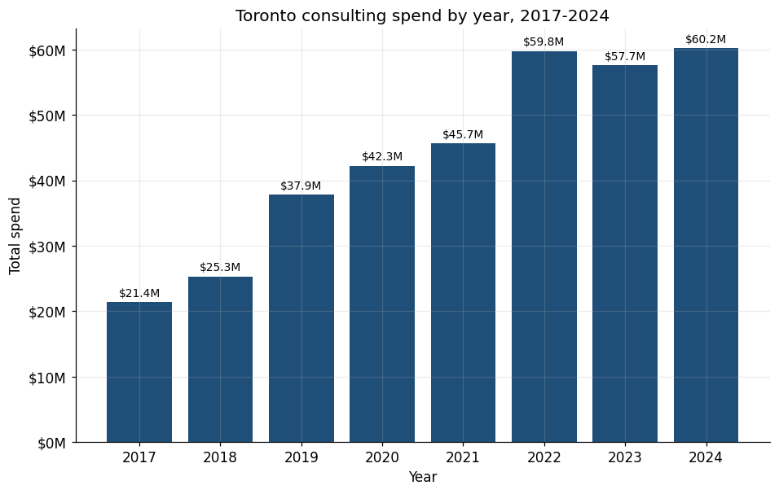
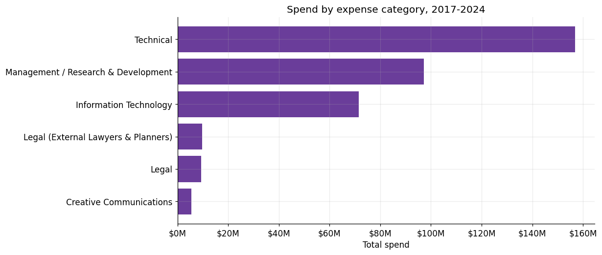
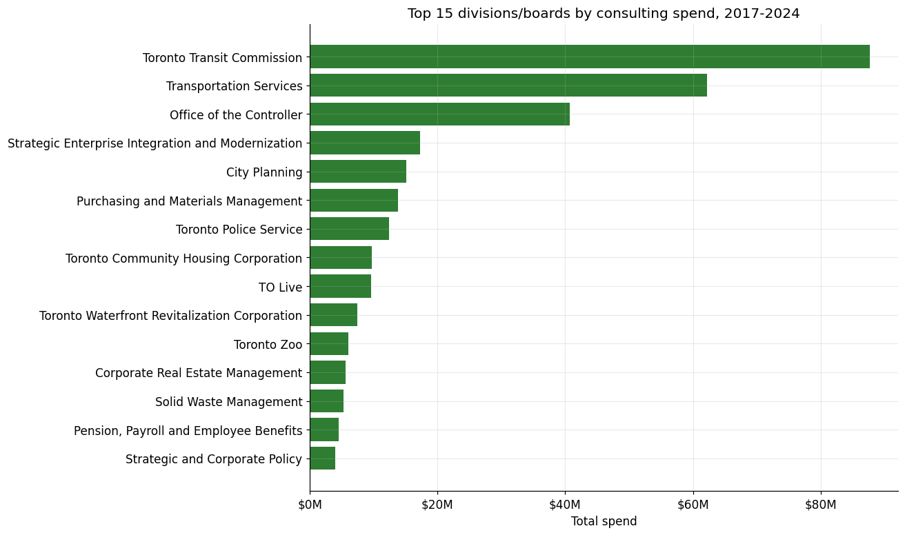
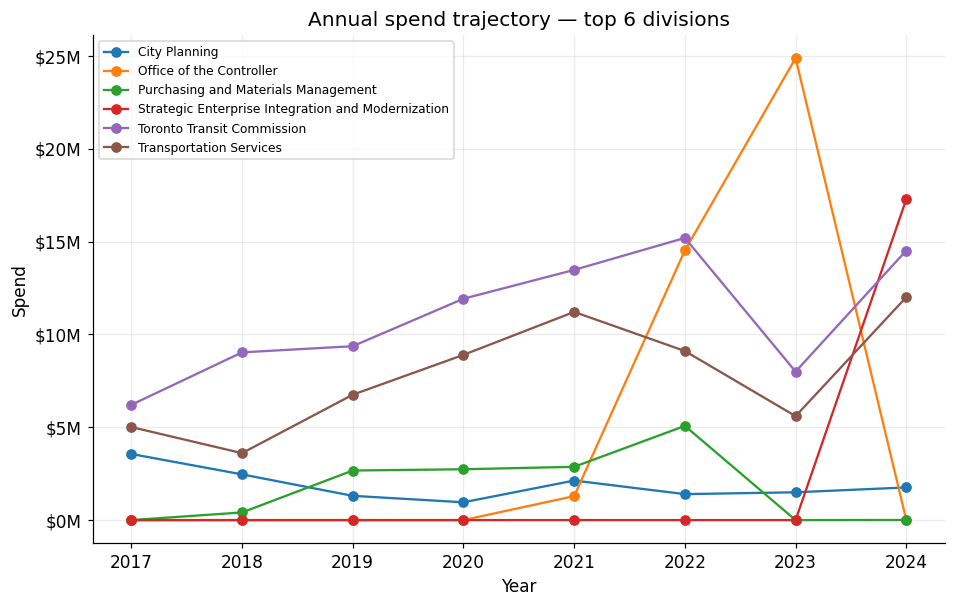
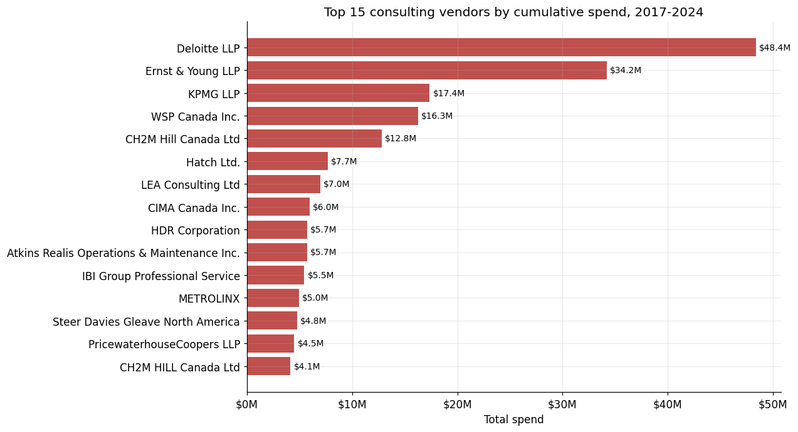
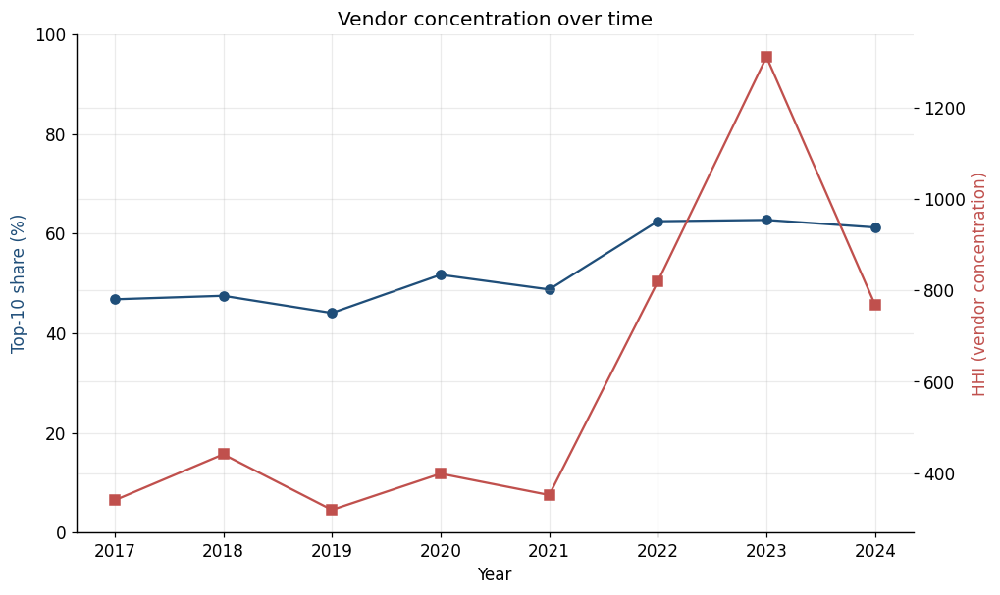
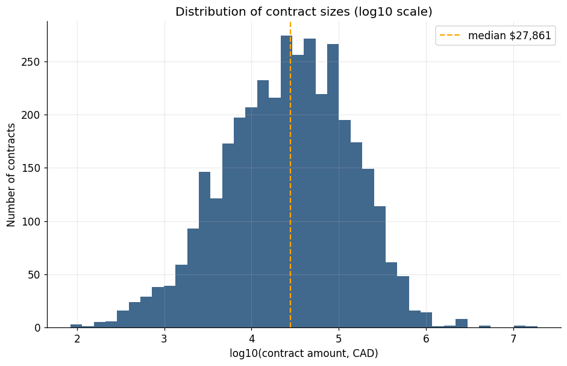

# Findings — Toronto Consulting Services, 2017-2024

A two-page summary of what the data shows. Charts are generated by
`src/analyze.py`; the underlying tables live in `data/processed/`.

## TL;DR

* Toronto's external consulting spend **nearly tripled** between 2017 ($21.4M)
  and 2024 ($60.2M), with the bulk of the growth landing in 2019-2022.
* Spend is **highly concentrated**: the top 5% of contracts account for 47% of
  all eight-year spend, and **Deloitte LLP alone** captures 13.8% of every
  consulting dollar Toronto paid in the period — $48.4M across 36 contracts.
* The Big-4-style firms (Deloitte, EY, KPMG) together absorb ~28% of total
  spend.
* An anomaly model surfaces a **$18.96M Deloitte IT engagement booked in 2023**
  — the single largest contract in the dataset and roughly 5x larger than any
  other IT consulting line in its year.

## 1. How much, and how fast

Annual spend climbed from $21.4M in 2017 to a plateau of ~$60M in 2022-2024.
The number of distinct vendors used each year also grew (from ~200 to ~500),
but spend grew faster — so **average spend per vendor is up**.

## 2. Where does it go?

Two expense categories — "Technical" and "Management / Research & Development"
— dominate the picture. A small number of divisions absorb most of the
budget; the long tail of one-off departmental contracts is genuinely long.

The yearly trajectory by division shows several distinct stories: some lines
ramp up sharply post-2019, consistent with the city's pandemic-era technology
and policy programs.

## 3. Vendor concentration

The top five vendors by cumulative 2017-2024 spend:

| Rank | Vendor | Total | Share |
|---:|---|---:|---:|
| 1 | Deloitte LLP | $48.4M | 13.8% |
| 2 | Ernst and Young LLP | $34.2M | 9.8% |
| 3 | KPMG LLP | $17.4M | 5.0% |
| 4 | WSP Canada Inc. | $16.3M | 4.7% |
| 5 | CH2M Hill Canada Ltd | $12.8M | 3.7% |

Per-year vendor concentration:

The Herfindahl-Hirschman Index sits in the moderately-concentrated band, and
the top-10 vendors capture a large share of annual spend in every year of the
dataset.

## 4. Contract-size distribution

The distribution of log-amounts is roughly bell-shaped around a median of
~$28K, but with a long right tail.

| Slice of contracts | Share of total spend |
|---|---:|
| Top 1% (37 contracts) | 28.6% |
| Top 5% (183 contracts) | 47.1% |
| Top 10% (367 contracts) | 60.4% |

This is a textbook Pareto distribution — and the reason anomaly detection on
this dataset is so useful: a small number of contracts drive most of the
budget, and they should not pass unnoticed.

## 5. Anomaly detection — what to look at next

The model combines a per-(year, category) log-amount z-score with an
Isolation Forest trained on amount + category + division + budget type +
vendor frequency + contract-date offset. The top three flagged contracts:

| Year | Vendor | Amount | Category |
|---|---|---:|---|
| 2023 | Deloitte LLP | $18,956,279 | Information Technology |
| 2024 | Deloitte LLP | $13,715,432 | Information Technology |
| 2022 | Deloitte LLP | $11,122,028 | Information Technology |

Full ranked list (top 50): [`data/processed/anomalies.csv`](../data/processed/anomalies.csv)
(written by `python src/anomaly.py`).

These are the kinds of line items that journalists, auditors, and councillors
should pull descriptions on. The model is **not** claiming anything is wrong
with them — only that they are statistically extreme relative to the
peer group of contracts the city signed that year.

## 6. Open questions

* **Are these multi-year contracts?** The dataset reports the dollars hitting
  each fiscal year, not the contract total. A $19M line could be the bulk of
  a larger multi-year engagement.
* **Is the Deloitte IT spend tied to one program?** The descriptions point
  toward a transformation program; corroborating that would require linking
  to Council reports.
* **Has procurement diversification efforts had any effect?** The top-10
  share has not visibly fallen over the eight years studied.
